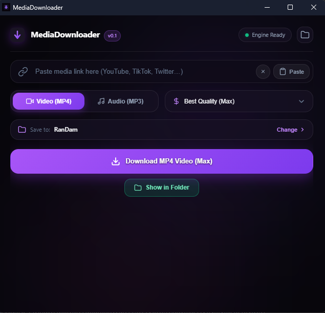
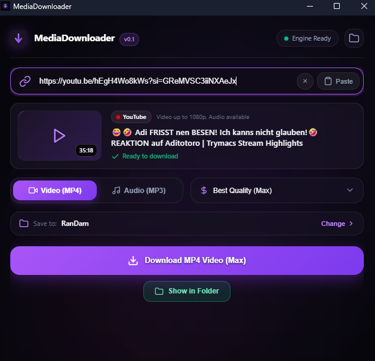
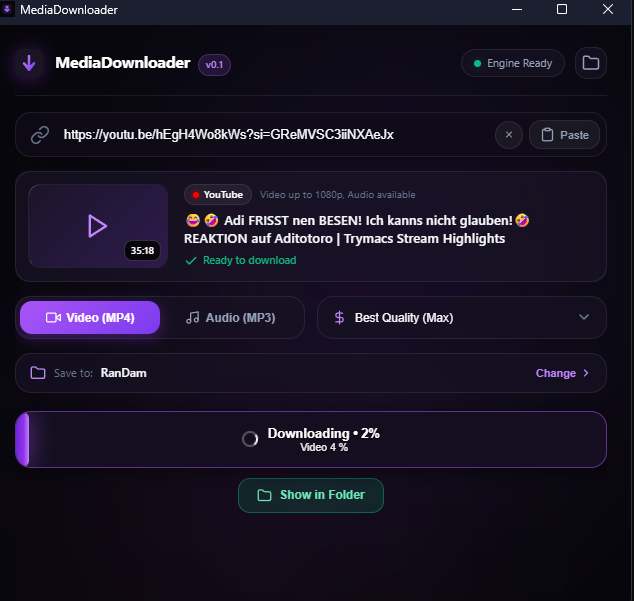

# MediaDownloader

A modern, minimalist, and high-performance desktop media downloader for Windows built with **Tauri 2**, **TypeScript**, and **Rust**. Powered by `yt-dlp` and `ffmpeg`.

<div align="center">
  
</div>

<div align="center" style="display: flex; gap: 10px; justify-content: center;">
  
  
</div>

---

## ✨ Features

- **Ultra-Minimal Dark Glass UI**: Modern dark glassmorphism design with fluid 60fps spring animations.
- **Animated Startup Screen**: Elegant brand intro with ambient glow and background engine warmup.
- **Rich Media Preview**: Automatic metadata extraction displaying video thumbnails, duration badges, platform pills (YouTube, TikTok, Instagram, Twitter/X, SoundCloud, etc.), and title.
- **Smart Link Input**: One-click clipboard paste button, instant drag-and-drop link detection, and keyboard shortcuts.
- **Sliding Format Switcher**: Smooth segmented control for **Video (MP4)** and **Audio (MP3)**.
- **Custom Quality Selector**: Choose between Best Quality (Max), 4K Ultra HD, 1080p Full HD, 720p HD, and 320 kbps High Quality audio.
- **Morphing Download & Progress Bar**: Glowing real-time progress bar with percentage counter, phase details, and success state.
- **Windows System Tray Integration**: Minimizes to the Windows Taskbar Notification Area on close (`✕`). Left-click restores the window, right-click opens the context menu (`Open MediaDownloader` / `Quit`).
- **Explorer Integration**: Quick-access button in the header and on completion to open the destination folder directly in Windows File Explorer.

---

## 🚀 Download & Installation

### Option 1: Windows Installer (Recommended)
Run `MediaDownloader-Setup.exe` to install the application with desktop shortcuts and system tray integration.

### Option 2: Portable Executable
Run `MediaDownloader.exe` directly from any folder.

---

## 🛠️ Build from Source

### Prerequisites
- [Node.js](https://nodejs.org/) (v18+)
- [Rust & Cargo](https://www.rust-lang.org/)
- Windows 10/11 with WebView2 runtime (pre-installed on modern Windows)

### Build Commands

```bash
# 1. Install dependencies
npm install

# 2. Fetch required sidecars (yt-dlp and quickjs)
npm run fetch-sidecars

# 3. Development Mode
npm run tauri dev

# 4. Production Build (generates Setup.exe and portable .exe)
npm run tauri build
```

The compiled binaries will be generated in:
- **Installer**: `src-tauri/target/release/bundle/nsis/MediaDownloader_0.1.0_x64-setup.exe`
- **Release Executable**: `src-tauri/target/release/medien-downloader.exe`

---

## 📄 License
MIT License.
